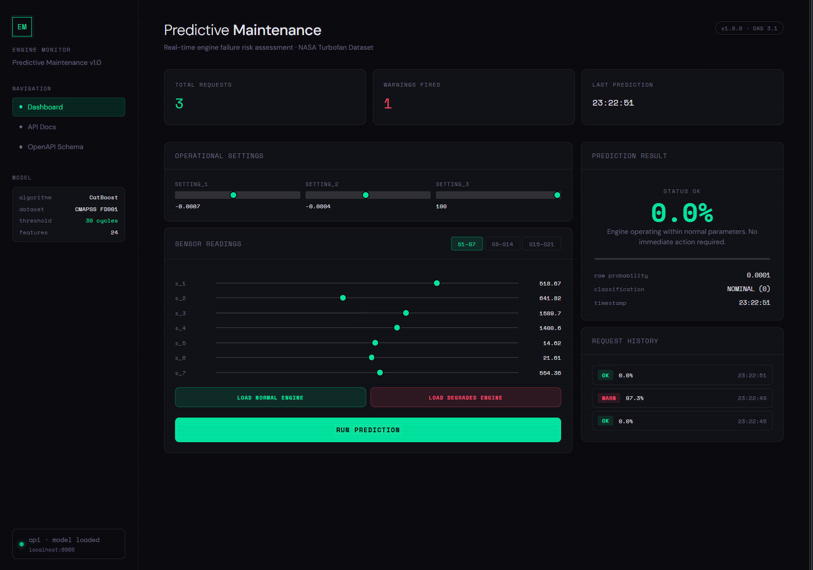

#  Engine Predictive Maintenance

ML-сервис предсказания отказа авиадвигателя по показаниям телеметрии.
Модель обучена на датасете [NASA CMAPSS FD001](https://www.nasa.gov/content/prognostics-center-of-excellence-data-set-repository) и развёрнута как REST API с интерактивным дашбордом.



##  Задача

Бинарная классификация: предсказать, откажет ли двигатель в течение следующих **30 рабочих циклов** на основе показаний 21 физического датчика (температура, давление, обороты) и 3 операционных параметров (высота, скорость, режим тяги).

Модель обнаруживает **системную деградацию** — когда несколько параметров одновременно отклоняются от нормы. Целевая метрика — **AUC-ROC** (приоритет из-за дисбаланса классов).

---

##  Структура проекта

```
engine_predictive_maintenance/
├── data/
│   └── raw/
│       └── train_FD001.txt       # Датасет NASA (включён в репо)
├── models/
│   └── engine_model.cbm          # Обученная модель (включена в репо)
├── src/
│   ├── api/
│   │   ├── main.py               # FastAPI — роуты и lifespan
│   │   ├── schemas.py            # Pydantic-схемы запроса/ответа
│   │   └── templates/
│   │       └── index.html        # Интерактивный дашборд
│   ├── models/
│   │   ├── preprocess.py         # Препроцессинг, расчёт RUL и меток
│   │   └── train.py              # Обучение CatBoost, сохранение модели
│   └── utils/
│       └── predictor.py          # Обёртка инференса
├── tests/
│   └── test_api.py
├── Makefile
├── Dockerfile
├── docker-compose.yml
└── requirements.txt
```

---

##  Интерфейс

При открытии `http://localhost:8000` — тёмный интерактивный дашборд:

- Кнопки **Normal Engine** / **Degraded Engine** — загружают реальные показания одним кликом
- Слайдеры для всех 24 параметров (3 настройки + 21 датчик)
- Цветной результат: зелёный (норма) / красный (риск отказа)
- Вероятность с прогресс-баром, история запросов, индикатор API

Swagger UI: `http://localhost:8000/docs`

---

##  Быстрый старт

### Требования
- [Docker](https://www.docker.com/get-started) + Docker Compose

### Запуск

```bash
git clone https://github.com/ImpereoT/engine-predictive-maintenance
cd engine-predictive-maintenance
docker-compose up --build
```

Открой `http://localhost:8000` — готово.

> Модель уже включена в репозиторий — обучать ничего не нужно.

---

##  Переобучение модели

Если хочешь переобучить модель на своих данных:

```bash
pip install -r requirements.txt
python -m src.models.preprocess
python -m src.models.train
docker-compose up --build
```

---

##  API

### `GET /health`
```json
{ "status": "ok", "model_loaded": true, "version": "1.0.0" }
```

### `POST /predict`

```bash
curl -X POST http://localhost:8000/predict \
  -H "Content-Type: application/json" \
  -d '{
    "setting_1": -0.0007, "setting_2": -0.0004, "setting_3": 100.0,
    "s_1": 518.67, "s_2": 641.82, "s_3": 1589.70, "s_4": 1400.60,
    "s_5": 14.62, "s_6": 21.61, "s_7": 554.36, "s_8": 2388.06,
    "s_9": 9046.19, "s_10": 1.30, "s_11": 47.47, "s_12": 521.66,
    "s_13": 2388.02, "s_14": 8138.62, "s_15": 8.4195, "s_16": 0.03,
    "s_17": 392.0, "s_18": 2388.0, "s_19": 100.0,
    "s_20": 39.06, "s_21": 23.419
  }'
```

```json
{
  "prediction": 0,
  "probability": 0.0842,
  "status": "OK",
  "message": "✅ Двигатель работает в норме. Вероятность отказа в течение 30 циклов: 8.4%."
}
```

---

##  Тесты

Тесты запускаются внутри Docker-контейнера:

```bash
# Запустить контейнер в фоне (если ещё не запущен)
docker-compose up -d

# Запустить тесты внутри контейнера
docker exec engine_maintenance_api pytest tests/ -v
```

---

##  Стек

| Слой | Инструмент |
|---|---|
| ML | CatBoost, scikit-learn |
| Data | pandas, numpy |
| API | FastAPI, Pydantic v2, Uvicorn |
| Frontend | Vanilla HTML / CSS / JS |
| Контейнеризация | Docker, Docker Compose |
| Тесты | pytest, httpx |
